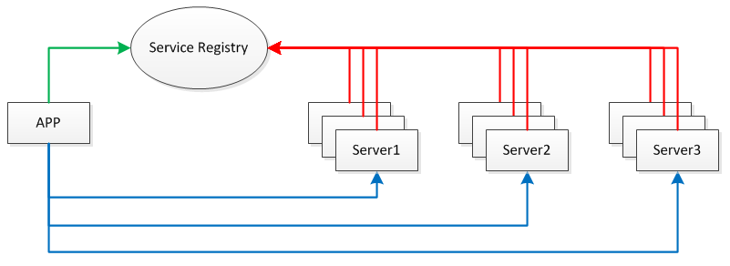

<h1>优雅的物联网架构</h1>
<p>技术选型:</p>

- [Netty](https://github.com/netty/netty)
- Maven
- Spring
- Mybatis(最少配置方案)
- Druid(数据源配置 sql防注入 sql性能监控)
- Google Protobuf解编码框架 Prostostuff：它基于Protobuf序列化框架，面向POJO，无需编写.proto文件。
- Quartz时间调度
- Redis Sentinel主从高可用方案(未整合)
- Redis Cluster集群高可用方案(未整合)
- RPC(远程过程调用)
- ZooKeeper(未实现)：提供服务注册与发现功能，开发分布式系统的必备选择，同时它也具备天生的集群能力。
- 持续更新中 @>+++++++<@
<hr/>

RPC,即Remote Proceduce Call(远程过程调用)，说的通俗一点就是:调用远程计算机上的服务,就像调用本地服务一样。

```
  RPC可基于HTTP或TCP协议，Web Service就是基于HTTP协议的RPC，它具有良好的跨平台性，但其性能却
不如基于TCP协议的RPC。会2方面会直接影响RPC的性能，一是传输方式，二是序列化。
众所周知，TCP是传输层协议，HTTP是应用层协议，而传输层较应用层更加底层，在数据传输方面，较底层越
快，因此，在一般情况下，TCP一定比HTTP快。就序列化而言,Java提供了默认的序列化方式，但在高并发的情况
下，这种方式将会带来一些性能上的瓶颈，于是市面上出现了一系列优秀的序列化框架，比如：Protobuf，Kryo,
Hession，Jackson等，它们可以取代Java默认的序列化，从而提供更高效的性能。
  为了支持高并发，传统的阻塞式IO显然不太合适，因此我们需要异步的IO，即NIO。Java提供了NIO的解决方案，
Java7也提供了更优秀的NIO.2支持，用Java实现了NIO并不是遥不可及的事情，只是需要我们熟悉NIO的技术细节。
  我们需要将服务器部署在分布式环境下的不同节点上，通过服务注册的方式，让客户端来自动发现当前可用的服务，
并调用这些服务。这需要一种服务注册表(Service Registry)的组件，让它来注册分布式环境下所有的服务地址(
包括：主机号与端口号)。
  每台Server上可发布多个Service,这些Service共用一个host与port,在分布式环境下会提供Server共同对外提供
Service。此外，为防止Service Registry出现单点故障，因此需要将其搭建为集群环境。
```

应用,服务，服务注册表之间的关系见下图:


Netty基本功能实现：

```
(1)心跳检测
基本解释：客户端异常掉线，比如断开网线或者断电等情况下，客户端的channel对象不会自动关闭，所以才引入了心跳的机制，
也就是服务器端通过监测在心跳期间内（1分钟）是否收到了客户端发过来的消息，来判断是否可以和客户端进行通信，
如果没有收到任何消息，则视为客户端掉线。心跳机制就是为了解决你说的这个问题的。不光是netty，所有基于socket的通信都有这个问题，
因为客户端和服务端是基于消息的协议，只有客户端主动发出断开的消息给服务端，服务端才能明确知道客户端断开了连接，
直接拔掉网线或者断电的情况下，属于底层的异常，客户端程序是根本监测不到的，即使你的客户端程序能够监测到，也没有用，
因为此时网线已经被拔掉了，根本没法给服务端发送消息。所以服务端才引入了心跳机制来对应这种异常情况，相当于超时机制，
超过规定时间没有接到消息，就视为客户端掉线了，以释放服务端的资源。
```

Google的[Protobuf](https://github.com/google/protobuf)在业界非常流行

```
(1)在谷歌内部长期使用，产品成熟度高;
(2)跨语言 支持多种语言，包括C++,Java和Python;
(3)编码后的消息更小，更加有利于存储和传输;
(4)编解码的性能非常高;
(5)支持不同协议的前向兼容;
(6)支持定义可选和必选字段。
```

<hr />

[Druid](https://github.com/alibaba/druid)号称是Java语言中最好的数据库连接池
```
1 可以监控数据库访问性能，Druid内置提供了一个功能强大的StatFilter插件，能够详细统计SQL的执行性能，这对于线上分析数据库
访问性能有帮助。
2 替换DBCP和C3P0。Druid提供了一个高效，功能强大，可扩展性好的数据库连接池。
3 数据库密码加密。直接把数据库密码写在配置文件中，这是不好的行为，容易导致安全问题。DruidDruiver和DruidDataSource都支持
PasswordCallback。
4 SQL执行日志，Druid提供了不同的LogFilter,能够支持Common-Logging,Log4j和JdkLog，你可以按需要选择相应的LogFilter，监控
你应用的数据库访问情况。
5 能够提供基于Filter - Chain模式的插件体系
```
下面介绍下如何在项目中集成Druid:
<br/>
1. maven依赖
```
<dependency>
            <groupId>com.alibaba</groupId>
            <artifactId>druid</artifactId>
            <version>${druid.version}</version>
</dependency>
```
2. 配置web.xml
```
<!-- druid -->  
<servlet>  
    <servlet-name>DruidStatView</servlet-name>  
    <servlet-class>com.alibaba.druid.support.http.StatViewServlet</servlet-class>  
</servlet>  
<servlet-mapping>  
    <servlet-name>DruidStatView</servlet-name>  
    <url-pattern>/druid/*</url-pattern>  
</servlet-mapping>  
  
<filter>  
    <filter-name>DruidWebStatFilter</filter-name>  
    <filter-class>com.alibaba.druid.support.http.WebStatFilter</filter-class>  
    <init-param>  
        <param-name>exclusions</param-name>  
        <param-value>*.js,*.gif,*.jpg,*.png,*.css,*.ico,/druid/*</param-value>  
    </init-param>  
</filter>  
<filter-mapping>  
    <filter-name>DruidWebStatFilter</filter-name>  
    <url-pattern>/*</url-pattern>  
</filter-mapping>  
```

3. spring.xml中配置druid数据源
```
<!-- 数据源druid -->  
<bean id="dataSource" class="com.alibaba.druid.pool.DruidDataSource"   
init-method="init" destroy-method="close">  
    <property name="driverClassName" value="${jdbc.driverClassName}" />  
    <property name="url" value="${jdbc.url}" />  
    <property name="username" value="${jdbc.username}" />  
    <property name="password" value="${jdbc.password}" />  
      
     <!-- 配置初始化大小、最小、最大 -->    
    <property name="initialSize" value="${druid.pool.size.init}" />    
    <property name="minIdle" value="${druid.pool.size.min}" />     
    <property name="maxActive" value="${druid.pool.size.max}" />    
      
    <!-- 配置监控统计拦截的filters，去掉后监控界面sql无法统计 -->  
    <property name="filters" value="stat" />   
</bean>  
```
**添加之后的效果如下：**<br/>

<hr />

## **二、测试**<br>

###  单客户端测试以及调试功能(SingleTest)


| frame_head    | Dir     | CommunicationID| SIMCCID | Produc  | Comm    | date_length | data | frame_tail|
|:-------------:|:-------:|:--------------:|:-------:|:-------:|:-------:|：----------：|:----:|:---------:|
| 帧头           | 方向    | 身份码          |SIM卡编码 |产品码    |功能码   |数据长度       |数据  | 帧尾       |
|  4bytes       | 1bytes |   13 bytes      |20 bytes  | 1       |1 bytes | 2 bytes      |不固定 | 2bytes    |
| _YD_          | 0x01   |    ----         |----      | 0x03    | 0x0A   | 详情如下      |---   | ##         |


### 多客户端测试以及性能和压力测试
 1. client模块中的`client.Client`类提供了进行压力测试的方法，可以修改启动客户端连接的数量`Client.clientNum`，
 以及每秒向服务器发送的协议的频率`Client.frequency`进行压力测试。<br>
 2. CPU 8核E3-1231v3， 每个服务分配1G的堆内存，启动5000个客户端后(需要一定时间)，
 不停给自己发送协议消息，发现auth、logic、gate服务占用的cpu非常低，客户端能够立即收到响应。对应的TPS统计将在后续加入。<br>