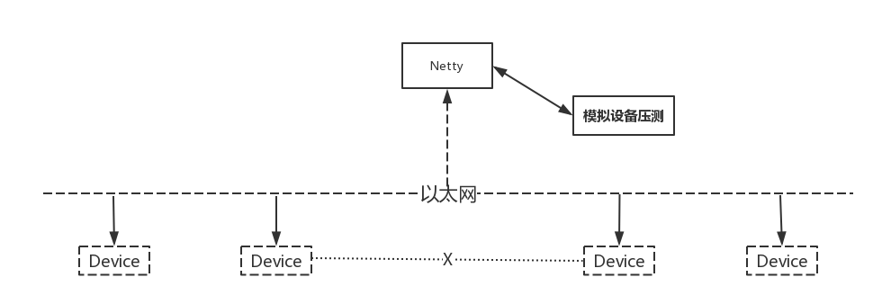

<h1>优雅的物联网架构</h1>

技术选型:

- [Netty](https://github.com/netty/netty)
- Maven
- SpringBoot
- Mybatis(最少配置方案)
- Druid(数据源配置 sql防注入 sql性能监控)
- Google Protobuf解编码框架 Prostostuff：它基于Protobuf序列化框架，面向POJO，无需编写.proto文件。
- Quartz时间调度
- Redis Sentinel主从高可用方案
- Redis Cluster集群高可用方案(未整合)
- RPC(远程过程调用)
- ZooKeeper(未实现)：提供服务注册与发现功能，开发分布式系统的必备选择，同时它也具备天生的集群能力。
- 持续更新中 @>+++++++<@

