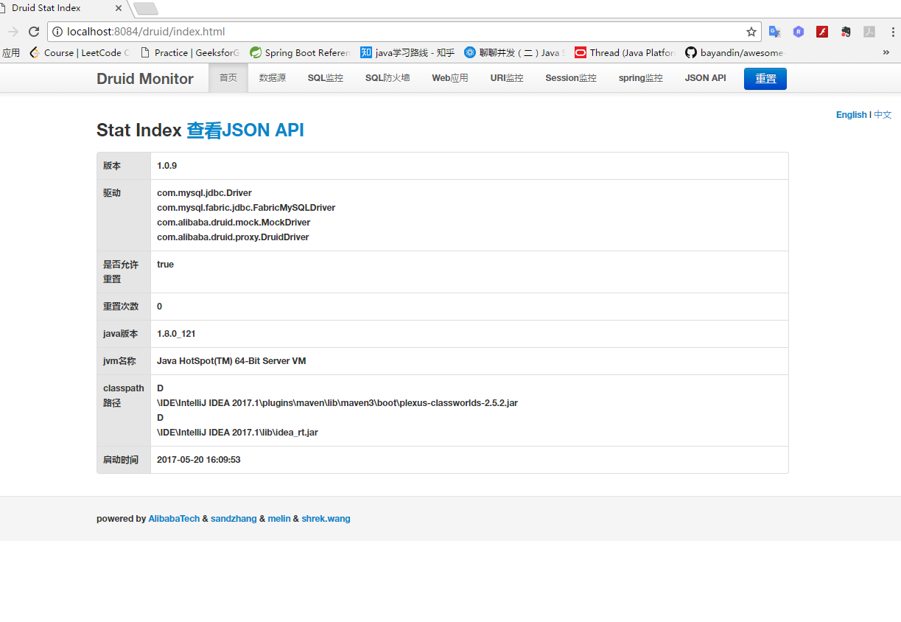

## 在SpringBoot中使用Druid作为数据源

### Druid介绍
Druid号称是Java语言中最好的数据源连接池。
1. 可以监控数据库访问性能,Druid内置提供了一个功能强大的StatFilter插件，能够详细统计SQL的执行性能，这对于线上分析数据库访问性能有帮助。
2. 替换DBCP和C3PO。Druid提供了一个高晓,功能强大，可扩张性好的数据库连接池。
3. 数据库密码加密。直接把数据库密码写在配置文件中，这是不好的行为，容易导致安全问题。DruidDriver和DruidDataSource都支持PasswordCallback.
4. SQL执行日志，Druid提供了不同的LogFilter，能够支持Common-Logging、Log4j和JdkLog，你可以按需要选择相应的LogFilter，监控你应用的数据库访问情况。
5. 能够提供基于Filter－Chain模式的插件体系。
### 下面介绍下如何在SpringBoot项目中集成Druid:
#### 1.maven依赖

```xml
<dependency>  
        <groupId>com.alibaba</groupId>  
        <artifactId>druid</artifactId>  
        <version>${druid-version}</version>  
    </dependency>
```
#### 2.配置数据源相关信息
- [x] **application.properties**

```xml
# 数据库访问配置
# 主数据源，默认的
spring.datasource.type=com.alibaba.druid.pool.DruidDataSource
spring.datasource.driver-class-name=com.mysql.jdbc.Driver
spring.datasource.url=jdbc:mysql://localhost:3306/test
spring.datasource.username=root
spring.datasource.password=123456

# 下面为连接池的补充设置，应用到上面所有数据源中
# 初始化大小，最小，最大
spring.datasource.initialSize=5
spring.datasource.minIdle=5
spring.datasource.maxActive=20
# 配置获取连接等待超时的时间
spring.datasource.maxWait=60000
# 配置间隔多久才进行一次检测，检测需要关闭的空闲连接，单位是毫秒 
spring.datasource.timeBetweenEvictionRunsMillis=60000
# 配置一个连接在池中最小生存的时间，单位是毫秒 
spring.datasource.minEvictableIdleTimeMillis=300000
spring.datasource.validationQuery=SELECT 1 FROM DUAL
spring.datasource.testWhileIdle=true
spring.datasource.testOnBorrow=false
spring.datasource.testOnReturn=false
# 打开PSCache，并且指定每个连接上PSCache的大小 
spring.datasource.poolPreparedStatements=true
spring.datasource.maxPoolPreparedStatementPerConnectionSize=20
# 配置监控统计拦截的filters，去掉后监控界面sql无法统计，'wall'用于防火墙 
spring.datasource.filters=stat,wall,log4j
# 通过connectProperties属性来打开mergeSql功能；慢SQL记录
spring.datasource.connectionProperties=druid.stat.mergeSql=true;druid.stat.slowSqlMillis=5000
# 合并多个DruidDataSource的监控数据
#spring.datasource.useGlobalDataSourceStat=true
```
- [x] **SpringBoot Druid数据源配置**
```java
import com.alibaba.druid.pool.DruidDataSource;
import com.alibaba.druid.support.http.StatViewServlet;
import com.alibaba.druid.support.http.WebStatFilter;
import org.slf4j.Logger;
import org.slf4j.LoggerFactory;
import org.springframework.beans.factory.annotation.Value;
import org.springframework.boot.web.servlet.FilterRegistrationBean;
import org.springframework.boot.web.servlet.ServletRegistrationBean;
import org.springframework.context.annotation.Bean;
import org.springframework.context.annotation.Configuration;

import javax.sql.DataSource;
import java.sql.SQLException;

/**
 * @author穆书伟
 * @description SpringBoot Druid数据源配置
 * @date 2017年12月7日 下午19:12
 */
@Configuration
public class DruidConfig {

    private Logger logger = LoggerFactory.getLogger(DruidConfig.class);

    @Value("${spring.datasource.url}")
    private String dbUrl;

    @Value("${spring.datasource.username}")
    private String username;

    @Value("${spring.datasource.password}")
    private String password;

    @Value("${spring.datasource.driver-class-name}")
    private String driverClassName;

    @Value("${spring.datasource.initialSize}")
    private int initialSize;

    @Value("${spring.datasource.minIdle}")
    private int minIdle;

    @Value("${spring.datasource.maxActive}")
    private int maxActive;

    @Value("${spring.datasource.maxWait}")
    private int maxWait;

    @Value("${spring.datasource.timeBetweenEvictionRunsMillis}")
    private int timeBetweenEvictionRunsMillis;

    @Value("${spring.datasource.minEvictableIdleTimeMillis}")
    private int minEvictableIdleTimeMillis;

    @Value("${spring.datasource.validationQuery}")
    private String validationQuery;

    @Value("${spring.datasource.testWhileIdle}")
    private boolean testWhileIdle;

    @Value("${spring.datasource.testOnBorrow}")
    private boolean testOnBorrow;

    @Value("${spring.datasource.testOnReturn}")
    private boolean testOnReturn;

    @Value("${spring.datasource.filters}")
    private String filters;

    @Value("${spring.datasource.logSlowSql}")
    private String logSlowSql;

    @Bean
    public ServletRegistrationBean druidServlet() {
        ServletRegistrationBean reg = new ServletRegistrationBean();
        reg.setServlet(new StatViewServlet());
        reg.addUrlMappings("/druid/*");
        reg.addInitParameter("loginUsername", username);
        reg.addInitParameter("loginPassword", password);
        reg.addInitParameter("logSlowSql", logSlowSql);
        return reg;
    }

    @Bean
    public FilterRegistrationBean filterRegistrationBean() {
        FilterRegistrationBean filterRegistrationBean = new FilterRegistrationBean();
        filterRegistrationBean.setFilter(new WebStatFilter());
        filterRegistrationBean.addUrlPatterns("/*");
        filterRegistrationBean.addInitParameter("exclusions", "*.js,*.gif,*.jpg,*.png,*.css,*.ico,/druid/*");
        filterRegistrationBean.addInitParameter("profileEnable", "true");
        return filterRegistrationBean;
    }

    @Bean
    public DataSource druidDataSource() {
        DruidDataSource datasource = new DruidDataSource();
        datasource.setUrl(dbUrl);
        datasource.setUsername(username);
        datasource.setPassword(password);
        datasource.setDriverClassName(driverClassName);
        datasource.setInitialSize(initialSize);
        datasource.setMinIdle(minIdle);
        datasource.setMaxActive(maxActive);
        datasource.setMaxWait(maxWait);
        datasource.setTimeBetweenEvictionRunsMillis(timeBetweenEvictionRunsMillis);
        datasource.setMinEvictableIdleTimeMillis(minEvictableIdleTimeMillis);
        datasource.setValidationQuery(validationQuery);
        datasource.setTestWhileIdle(testWhileIdle);
        datasource.setTestOnBorrow(testOnBorrow);
        datasource.setTestOnReturn(testOnReturn);
        try {
            datasource.setFilters(filters);
        } catch (SQLException e) {
            logger.error("druid configuration initialization filter", e);
        }
        return datasource;
    }

}
```

#### 3.配置监控统计功能
- [x] **配置Servlet**

```java
import com.alibaba.druid.support.http.StatViewServlet;

import javax.servlet.annotation.WebInitParam;
import javax.servlet.annotation.WebServlet;

@WebServlet(urlPatterns = "/druid/*",
        initParams={
                @WebInitParam(name="allow",value="192.168.16.110,127.0.0.1"),// IP白名单 (没有配置或者为空，则允许所有访问)
                @WebInitParam(name="deny",value="192.168.16.111"),// IP黑名单 (存在共同时，deny优先于allow)
                @WebInitParam(name="loginUsername",value="jamesmsw"),// 用户名
                @WebInitParam(name="loginPassword",value="jamesmsw"),// 密码
                @WebInitParam(name="resetEnable",value="false")// 禁用HTML页面上的“Reset All”功能
        })
/**
 * @author 穆书伟
 * @date 2017年11月2日 10：19
 * @description Druid数据源连接池Servlet
 */
public class DruidStatViewServlet extends StatViewServlet {
    private static final long serialVersionUID = 1L;

}

```
- [x] **配置Filter**
```java
import com.alibaba.druid.support.http.WebStatFilter;

import javax.servlet.annotation.WebFilter;
import javax.servlet.annotation.WebInitParam;

@WebFilter(filterName="druidWebStatFilter",urlPatterns="/*",
        initParams={
                @WebInitParam(name="exclusions",value="*.js,*.gif,*.jpg,*.bmp,*.png,*.css,*.ico,/druid/*")// 忽略资源
        }
)
/**
 * @author 穆书伟
 * @date 2017年11月2日 10:10
 * @description Druid数据连接池过滤器
 */
public class DruidStatFilter extends WebStatFilter {

}

```
#### 4.使Druid数据源在SpringBoot中生效
- [x] **配置SpringBoot主启动类**
```java
import org.springframework.boot.SpringApplication;
import org.springframework.boot.autoconfigure.SpringBootApplication;
import org.springframework.boot.builder.SpringApplicationBuilder;
import org.springframework.boot.web.servlet.ServletComponentScan;
import org.springframework.boot.web.support.SpringBootServletInitializer;
 
@ServletComponentScan   //对就是它-就这一个注释！
@SpringBootApplication
public class WebApplication extends SpringBootServletInitializer {
    public WebApplication() {
        super();
        setRegisterErrorPageFilter(false);
    }
 
    @Override
    protected SpringApplicationBuilder configure(SpringApplicationBuilder application) {
        return application.sources(WebApplication.class);
    }
 
    public static void main(String[] args) throws Exception {
        SpringApplication.run(WebApplication.class, args);
    }
}
```
然后启动项目后访问 http://localhost:port/druid/index.html 即可查看数据源及SQL统计等。<br/>
截图如下： 



